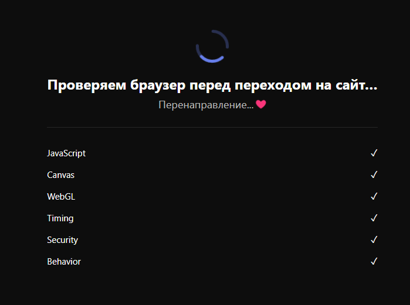
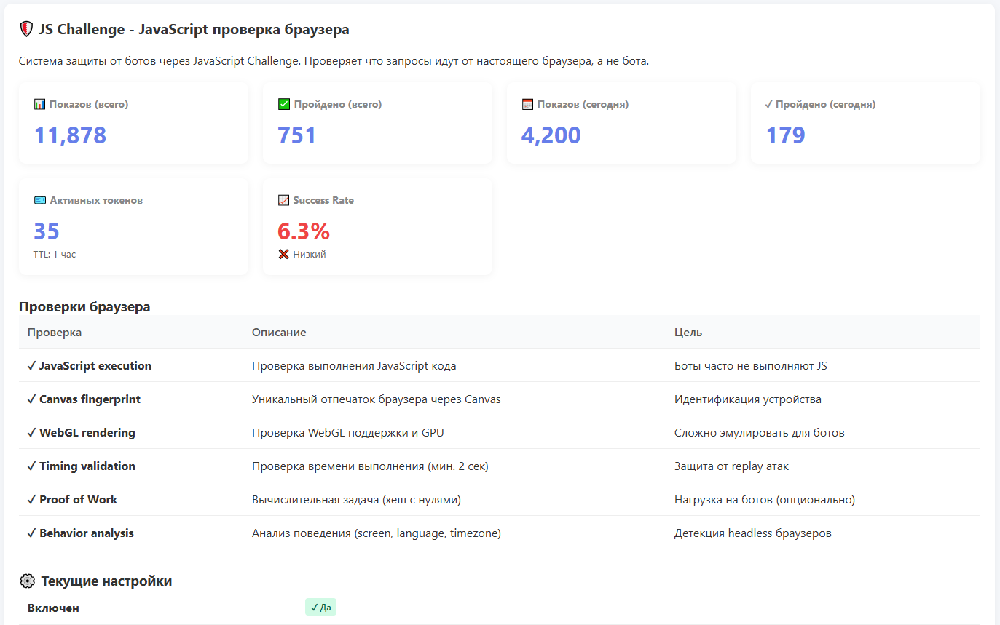
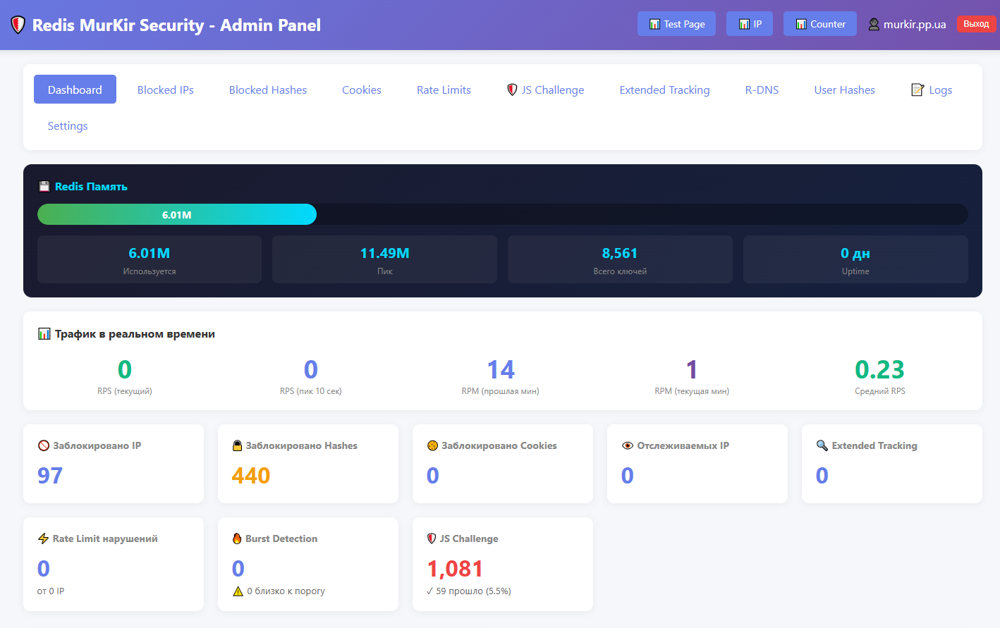
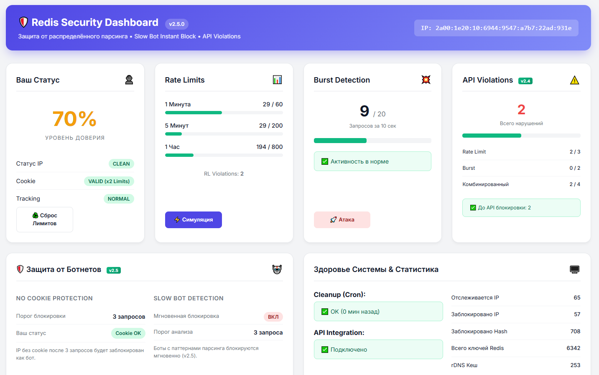
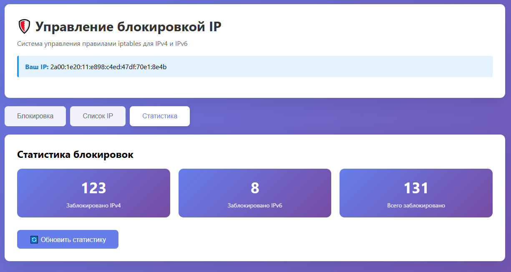

05.02.2026 js_challenge_lite + API + Ubuntu - очень удачно получилось! Нормальных людей и медленных ботов вообще не трогает, а всех быстрых в бан на час!

26.01.2026 - js_challenge_lite - теперь пропускает всех ботов из блого списка IP, и добавленно 2 скина проверки, и добавлена усиленная проверка PoW - для умных ботов.

15.01.2026 - js_challenge_lite она проверяет браузер и блокирует очень быстрых!

5.01.2026 - Сделал новую урезанную версию redis-bot_protection_lite - она блокирует только очень быстрых! Пока проблем с ней нет.

Обнаружил проблемы с поисковиками - пока не решил как это можно решить.
Добавлен минималистичный тёмный дизайн проверки!
Теперь нормально работают исключённые URL.
Выложил новую версию с кучей улучшений - блокирует всех кривых и умных ботов!
Добавленно JS Challenge - как у Cloudflare, и DDoS-Guard - это автоматическая система проверки браузера, которая определяет ботов без участия пользователя. В отличие от традиционных CAPTCHA, где нужно выбирать картинки или вводить текст, JS Challenge работает полностью автоматически: браузер сам доказывает, что он настоящий.

Если вам не понятно как настраивать и что это и как оно работает - спросите у Claude! Мы с ним это делали вместе!

Кому интересно, напишите сюда!

https://t.me/murkir_security

https://murkir.pp.ua/news/76-nevidimaya-zaschita-ot-botov-novogo-pokoleniya

Ниже скриншоты новой версии!





# Redis MurKir Security - Система защиты от ботов

Добавленна работа с API в Ubuntu 22 - теперь можно блокировать IP в iptables - для работы API должен в php.ini не заблокирован exec и желательно на другой версии php и без защиты чтоб не блокировало само себя!
Минимальное потребление памяти Redis в новой версии с JS Challenge!

Подключение защиты. Нужно в самом верху на пример в index.php добавить эту строку.

require_once $_SERVER['DOCUMENT_ROOT'] . '/Redis-Bot-Protection/inline_check.php';

Или сюда добавить строку или в php.ini

/etc/php/7.4/fpm/pool.d/php7.conf

php_admin_value[auto_prepend_file] = "/home/user/site/Redis-Bot-Protection/inline_check.php"


# Ubuntu/Debian
sudo apt-get update
sudo apt-get install redis-server php-redis

# CentOS/RHEL
sudo yum install redis php-redis

# Запустите Redis
sudo systemctl start redis
sudo systemctl enable redis

## 🎯 Назначение

Комплексная система защиты веб-сайта от ботов и автоматизированных атак с использованием Redis для хранения данных. Работает без сессий PHP, используя стабильные пользовательские хеши.

## 🏗️ Архитектура

### Основные компоненты:

1. **inline_check.php** - Ядро защиты (класс `RedisBotProtectionNoSessions`)
2. **redis-admin-panel.php** - Web-интерфейс администратора
3. **Redis** - Хранилище данных и кеша

## 🛡️ Ключевые механизмы защиты

### 1. **Rate Limiting** (ограничение скорости)
- 60 запросов/минуту, 200/5мин, 1000/час
- Прогрессивная блокировка нарушителей (30мин → 2ч → дольше)
- Детекция burst-атак (20+ запросов за 10 сек)

### 2. **User Hash Tracking** (отслеживание по отпечатку)
- Стабильный хеш: IP + Browser + OS + Headers
- Разные алгоритмы для мобильных (частичный IP) и десктопов (полный IP)
- Блокировка по хешу даже при смене IP

### 3. **Детекция поведенческих паттернов**
- **Быстрые боты**: высокая частота запросов, регулярные интервалы
- **Медленные боты**: долгие сессии, низкое разнообразие страниц, отсутствие заголовков
- **Расширенное отслеживание**: автоматическое включение для подозрительных

### 4. **Верификация поисковых систем**
- Проверка Google, Bing, Yandex и других через rDNS
- Двухэтапная верификация: обратный DNS → прямой DNS
- Rate limiting для rDNS (60 проверок/мин) + кеширование (30мин)

### 5. **Детекция аномалий**
- Смена User-Agent (>5 за 5 мин = блокировка)
- Подозрительные паттерны (curl, wget, python и т.д.)
- Отсутствие критичных HTTP-заголовков

### 6. **Cookie-based защита**
- Выдача проверочных cookie легитимным пользователям
- Блокировка скомпрометированных cookie
- Верификация через HMAC подпись

## 🔧 Техническая реализация

### Оптимизация производительности:
- **Вероятностная очистка**: проверка переполнения только у 2% запросов
- **SCAN вместо KEYS**: неблокирующее сканирование Redis
- **Лимит времени**: максимум 50ms на одну очистку
- **Умный кеш**: счетчик tracked IP для быстрой проверки

### Защита от переполнения Redis:
- Автоматическое удаление старых записей (TTL-based)
- Приоритетная очистка неактивных IP
- Настраиваемый порог (5000 записей по умолчанию)

## 📊 Административная панель

### Разделы:
- **Dashboard**: общая статистика, память Redis, быстрые действия
- **Blocked IPs/Hashes/Cookies**: просмотр и разблокировка
- **Rate Limits**: мониторинг нарушений с визуальной индикацией
- **Extended Tracking**: расширенное отслеживание подозрительных
- **R-DNS**: статистика и управление кешем верификации
- **User Hashes**: все отпечатки в системе
- **Logs**: журнал поисковых систем и ботов
- **Settings**: просмотр всех настроек защиты

### Возможности:
- ✅ Разблокировка IP/Hash/Cookie одним кликом
- ✅ Сброс Rate Limit счетчиков
- ✅ Ручная блокировка нарушителей
- ✅ Очистка кеша rDNS и Redis
- ✅ Копирование данных в буфер обмена
- ✅ Живой поиск по таблицам
- ✅ Цветовая индикация опасности

## 🎚️ Настраиваемость

Все параметры легко настраиваются под нагрузку сайта:
```php
// Для крупных сайтов (>10k посетителей/день)
$protection->updateRateLimitSettings([
    'max_requests_per_minute' => 120,
    'max_requests_per_5min' => 500,
    'burst_threshold' => 40
]);

$protection->updateRDNSSettings([
    'max_rdns_per_minute' => 200,
    'rdns_cache_ttl' => 7200
]);
```

## 📈 Мониторинг

Встроенные методы для контроля:
- `getStats()` - общая статистика
- `getTopRateLimitViolators()` - топ нарушителей
- `getRDNSRateLimitStats()` - состояние rDNS
- `getRedisMemoryInfo()` - использование памяти

## 🚀 Особенности

- ⚡ **Минимальный оверхед**: <2ms на обычный запрос
- 🔒 **Без блокировок**: все операции неблокирующие
- 📱 **Умная детекция**: адаптация под мобильные/десктоп
- 🌍 **IPv6 ready**: полная поддержка IPv6 с нормализацией
- 🎯 **Точность**: минимум ложных срабатываний
- 🛠️ **Гибкость**: все параметры настраиваются в runtime

## 💾 Требования

- PHP 7.4+ с расширением Redis
- Redis 5.0+
- Доступ к DNS для rDNS проверок

---

**Результат**: Надежная, производительная система защиты, готовая к production использованию на сайтах любого масштаба.
